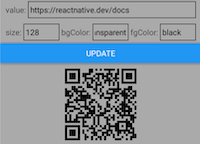

# **rn-qrcode-svg**

It's a React Native component to generate QRCode. It uses SVG (`react-native-svg`) to draw QRCode.

## **How to install this package**

Because this is a React Native component, you must install it on a React Native project. Beside that, you must also install
`react-native-svg` package. You may use the following console command:

    npm i react-native-svg rn-qrcode-svg

For iOS, there is another step:

    cd ios && pod install && cd ..

## **Component Props**

<table>
<tr>
    <th>Name</th>
    <th>Type</th>
    <th>Description</th>
    <th>Default Value</th>
</tr>
<tr>
    <td valign='top'>bgColor</td>
    <td valign='top'>color value</td>
    <td valign='top'>The light color (canvas color)</td>
    <td valign='top'>"transparent"</td>
</tr>
<tr>
    <td valign='top'>ecl</td>
    <td valign='top'>enum("L", "M", "Q", "H")</td>
    <td valign='top'>Error correction level for QR code:
        <ul>
            <li>L (low)</li>
            <li>M (medium)</li>
            <li>Q (quartile)</li>
            <li>H (high)</li>
        </ul>
        You can use predefined constants as in the example below:
<small>
<pre>
...
<nobr>import QRCode, {ECL} from 'rn-qrcode-svg';</nobr>
...
    <nobr>&lt;QRCode ecl={ECL.M}  ... /&gt;</nobr>
</pre>
</small>
    </td>
    <td valign='top'>"H"</td>
</tr>
<tr>
    <td valign='top'>fgColor</td>
    <td valign='top'>color value</td>
    <td valign='top'>The dark color (dots color)</td>
    <td valign='top'>"black"</td>
</tr>
<tr>
    <td valign='top'>logo</td>
    <td valign='top'>Object:
<small>
<pre>{
    <nobr>asBackground?: boolean,</nobr>
    <nobr>centerized?: boolean,</nobr>
    <nobr>height?: number | string,</nobr>
    <nobr>href: ImageSource | string,</nobr>
    <nobr>opacity?: number | string,</nobr>
    <nobr>preserveAspectRatio?: string,</nobr>
    <nobr>width?: number | string,</nobr>
    <nobr>x?: number | string,</nobr>
    <nobr>y?: number | string,</nobr>
}</pre>
</small>
    </td>
    <td valign='top'>It's to set the logo image that you want to place on the QRCode image. This prop value
        is an object containing some properties which determine the attributes of logo. The only required
        property is <code>href</code>. This property is to set the source of image. Almost all properties
        are the same as the props of <a
        href="https://github.com/software-mansion/react-native-svg/blob/main/USAGE.md#image">svg <code>Image</code></a>
        element. Two properties which do not belong to <code>Image</code> element:
        <ul>
            <li><code>asBackground</code> is a boolean value to determine whether the logo image is drawn
                behind of QRCode dots or in the front of them. The default value is <code>false</code>
                (the logo is drawn in front of the QRCode dots or it will cover some dots).</li>
            <li><code>centerized</code> is a boolean value to determine whether the logo is positioned at
                the center of QRCode image or not. The default value is <code>false</code> which means the
                position of logo is determined by the value of <code>x</code> and <code>y</code> property.
                If the position of logo is centerized then <code>x</code> and <code>y</code> property are
                ignored.</li>
        </ul>
        Beside the properties listed here, you may also use the <a
        href="https://github.com/software-mansion/react-native-svg/blob/main/USAGE.md#common-props">common
        props</a> for svg elements.<br/>
        <br/>
        Need to know that we can place a logo on a QRCode image because of the existence of error correction
        in QRCode. But, we must still set the position and dimension of logo carefully because it can cause
        the QRCode cannot be read.
    </td>
    <td valign='top'></td>
</tr>
<tr>
    <td valign='top'>onError</td>
    <td valign='top'>function(errorMessage)</td>
    <td valign='top'>The handler that will be called when an error happens in generating QRCode image</td>
    <td valign='top'>It will displays an alert dialog saying "Cannot generate QR Code" and logs the error
        message to the console.</td>
</tr>
<tr>
    <td valign='top'>size</td>
    <td valign='top'>number</td>
    <td valign='top'>The size of QRCode image</td>
    <td valign='top'>128</td>
</tr>
<tr>
    <td valign='top'>value</td>
    <td valign='top'>All data that can be passed to
        <a href="https://github.com/atmulyana/qr-code#the-parameters-of-qr-function"><code>qr</code></a>
        function
    </td>
    <td valign='top'>The encoded data</td>
    <td valign='top'>Required (you must set this prop)</td>
</tr>
<tr>
    <td valign='top'>version</td>
    <td valign='top'>number range[1..40]</td>
    <td valign='top'>The size of QRCode. Different from <code>size</code> prop, it's the size of data
        matrix. There are 40 sizes available: the smallest (version 1) is 21x21 and the largest
        (vesrsion 40) is 177x177. There will be an error if the chosen size is too small to accommodate
        the encoded data. The data capacity is also affected by the error correction level (higher level
        is less capacity).</td>
    <td valign='top'>The smallest size that can accommodate the encoded data.</td>
</tr>
</table>

## **Example**
```javascript
import React from 'react';
import {Button, SafeAreaView, StyleSheet, Text, TextInput, View} from 'react-native';
import QRCode from 'rn-qrcode-svg';

const styles = StyleSheet.create({
    line: {
        alignItems: 'center',
        flexDirection: 'row',
        marginHorizontal: 10,
        marginVertical: 5,
    },
    main: {
        backgroundColor: '#aaa',
        flex: 1,
    },
    qrBox: {
        alignItems: 'center',
        justifyContent: 'center',
        padding: 10,
    },
    text: {
        borderWidth: 1,
        flex: 1,
        paddingVertical: 0,
    },
});

export default function() {
    const [value, setValue] = React.useState("https://reactnative.dev/docs"),
          [size, setSize] = React.useState('128'),
          [bgColor, setBgColor] = React.useState('transparent'),
          [fgColor, setFgColor] = React.useState('black'),
          [qrProp, setQrProp] = React.useState({value, size, bgColor, fgColor});
    return <SafeAreaView style={styles.main}>
        <View style={styles.line}>
            <Text>{'value: '}</Text>
            <TextInput value={value} onChangeText={setValue} style={styles.text} />
        </View>
        <View style={styles.line}>
            <Text>{'size: '}</Text>
            <TextInput value={size} onChangeText={setSize} style={styles.text} />
            <Text>{' bgColor: '}</Text>
            <TextInput value={bgColor} onChangeText={setBgColor} style={styles.text} />
            <Text>{' fgColor: '}</Text>
            <TextInput value={fgColor} onChangeText={setFgColor} style={styles.text} />
        </View>
        <Button title='Update' onPress={() => setQrProp({value, size, bgColor, fgColor})} />
        <View style={styles.qrBox}>
            <QRCode {...qrProp} />
        </View>
    </SafeAreaView>;
}
```

Output:




    <QRCode value="https://reactnative.dev/docs" logo={{href: require('./images/react-native.png')}} />

Output:


    <QRCode
        value="https://reactnative.dev/docs"
        logo={{
            href: require('./images/react-native.png'),
            centerized: true,
            height: 40,
            width: 60,
        }}
    />

Output:


    <QRCode
        value="https://reactnative.dev/docs"
        logo={{
            href: require('./images/react-native.png'),
            asBackground: true,
            height: '60%',
            width: '60%',
            x: '50%',
            y: '60%',
        }}
    />

