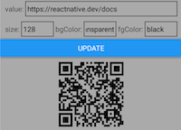

# **rn-qrcode-svg**

It's a React Native component to generate QRCode. It rewrites another package from
[https://github.com/rishichawda/react-native-qrcode-generator](https://github.com/rishichawda/react-native-qrcode-generator).
`react-native-qrcode-generator` uses WebView (`react-native-webview`) which renders HTML canvas to draw QRCode. This package,
however, uses SVG (`react-native-svg`). It improves the performance of rendering.

## **How to install this package**

Because this is a React Native component, you must install it on a React Native project. Beside that, you must also install `qr.js`
and `react-native-svg` package. You may use the following console command:

    npm i qr.js react-native-svg rn-qrcode-svg

## **Component Props**

|Name      |Type        |Default value          |Description                    |
|----------|------------|-----------------------|-------------------------------|
|`bgColor` |color value |`'transparent'`        |The light color (canvas color) |
|`fgColor` |color value |`'black'`              |The dark color (ink color)     |
|`size`    |`number`    |`128`                  |The size of QRCode image       |
|`value`   |`string`    |Required (no default)  |The value of QRCode            |

## **Example**
```javascript
import React from 'react';
import {Button, SafeAreaView, StyleSheet, Text, TextInput, View} from 'react-native';
import QRCode from 'rn-qrcode-svg';

const styles = StyleSheet.create({
    line: {
        alignItems: 'center',
        flexDirection: 'row',
        marginHorizontal: 10,
        marginVertical: 5,
    },
    main: {
        backgroundColor: '#aaa',
        flex: 1,
    },
    qrBox: {
        alignItems: 'center',
        justifyContent: 'center',
        padding: 10,
    },
    text: {
        borderWidth: 1,
        flex: 1,
        paddingVertical: 0,
    },
});

export default function() {
    const [value, setValue] = React.useState("https://reactnative.dev/docs"),
          [size, setSize] = React.useState('128'),
          [bgColor, setBgColor] = React.useState('transparent'),
          [fgColor, setFgColor] = React.useState('black'),
          [qrProp, setQrProp] = React.useState({value, size, bgColor, fgColor});
    return <SafeAreaView style={styles.main}>
        <View style={styles.line}>
            <Text>{'value: '}</Text>
            <TextInput value={value} onChangeText={setValue} style={styles.text} />
        </View>
        <View style={styles.line}>
            <Text>{'size: '}</Text>
            <TextInput value={size} onChangeText={setSize} style={styles.text} />
            <Text>{' bgColor: '}</Text>
            <TextInput value={bgColor} onChangeText={setBgColor} style={styles.text} />
            <Text>{' fgColor: '}</Text>
            <TextInput value={fgColor} onChangeText={setFgColor} style={styles.text} />
        </View>
        <Button title='Update' onPress={() => setQrProp({value, size, bgColor, fgColor})} />
        <View style={styles.qrBox}>
            <QRCode {...qrProp} />
        </View>
    </SafeAreaView>;
}
```

Output:

